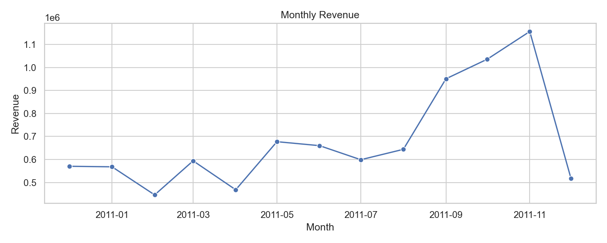

# E-commerce Analytics Portfolio (Online Retail)

This project walks through an end-to-end analytics workflow using the UCI Online Retail dataset.

## Goals
- Clean and validate transactional data
- Explore revenue patterns by time, country, and product
- Produce clear, publishable charts

## Dataset
Source: https://archive.ics.uci.edu/ml/datasets/Online+Retail
File: `data/online_retail.xlsx`

## Project structure
- `data/` raw data (not tracked by default)
- `data/processed/` cleaned output
- `src/` scripts for cleaning and EDA
- `reports/figures/` charts saved by EDA
- `notebooks/` optional exploration notebooks

## Workflow
1) Download dataset (see `data/README.md`)
2) Run cleaning script
3) Run EDA script to generate charts

## How to run
```powershell
python -m venv .venv
.\.venv\Scripts\Activate.ps1
pip install -r requirements.txt
python src\cleaning.py
python src\eda.py
```

## Outputs
- `data/processed/online_retail_clean.csv`
- `reports/figures/` charts

## Write-up (short)
This project demonstrates a complete analytics pipeline for e-commerce transactions. The data is cleaned by removing cancellations, missing customer IDs, and invalid quantities/prices, then enriched with a `TotalPrice` field. The EDA focuses on revenue over time, geographic concentration, and top products, with charts saved for portfolio use.

## Key Insights
- Seasonality is clear: revenue rises from late summer and peaks in October-November, then falls sharply in the final month. The last-month drop likely reflects partial data coverage, but the Q4 surge is still pronounced.
- Revenue is highly concentrated by country: the United Kingdom accounts for the vast majority of sales, with the Netherlands, EIRE, Germany, and France trailing far behind. This suggests reliance on one core market and a clear opportunity for diversification.
- A small set of gift and home decor items drive a large share of revenue. Examples like "PAPER CRAFT, LITTLE BIRDIE" and "REGENCY CAKESTAND 3 TIER" lead the list, so inventory and merchandising for these SKUs likely has outsized impact.
- Non-merchandise line items appear in the top products list (for example, "Postage" and "Manual"), indicating shipping fees and adjustments materially affect revenue totals. Separating these from product revenue would improve product-level reporting.
## Charts
If images are missing, run `python src\eda.py`.




## Notes
The scripts drop cancellations (InvoiceNo starting with "C"), missing customer IDs, and non-positive quantities/prices.

